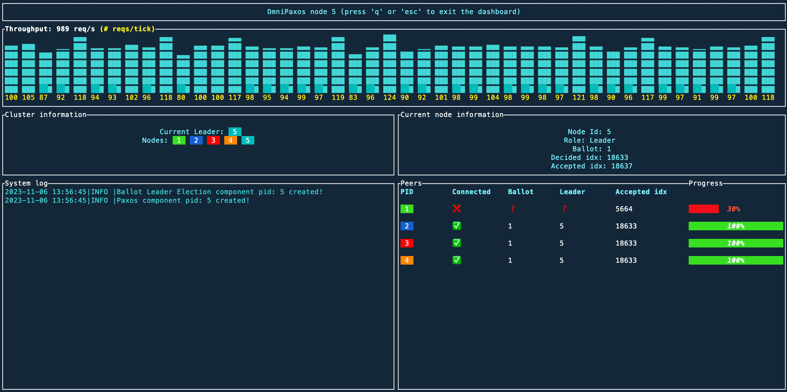

OmniPaxos provides an in-terminal dashboard that can be connected to the OmniPaxos nodes. The dashboard displays the performance, the connectivity, and who is the current leader in the cluster.



## Usage
To use the dashboard, import the `omnipaxos_ui` dependency:

```rust
[dependencies]
omnipaxos_ui = "LATEST_VERSION"
```

We need to setup the dashboard using the same `OmniPaxosConfig` that was used to set up OmniPaxos (example [here](../omnipaxos)) and then call the public function `start()` to start showing the UI in the terminal.

```rust
// op_config: OmniPaxosConfig
// let mut omni_paxos: OmniPaxos<Entry, Storage> = op_config.build().unwrap();
let mut omni_paxos_ui = OmniPaxosUI::with(op_config.into());
omni_paxos_ui.start();
```

The dashboard gets updated and re-rendered via the `tick()` function that needs to be called periodically with the states retrieved from the OmniPaxos node. The time period between `tick()`s can be customized depending on how often we want the UI to be re-rendered with updated state. The more frequent, the more updated the dashboard will be, but that might also incur more overhead. From our experience, calling `tick()` every 100ms is a good starting point.

```rust
// Call this periodically e.g., every 100ms
let ui_states = omni_paxos.get_ui_states();
omni_paxos_ui.tick(ui_states);
```

The dashboard has different views depending on if it is connected to the leader or follower server. The leader's dashboard has more information such as the replication lag of the followers. 

> :tv: To see the dashboard in action, check out our demo on [YouTube](https://youtu.be/Jq0M39MCnK4).