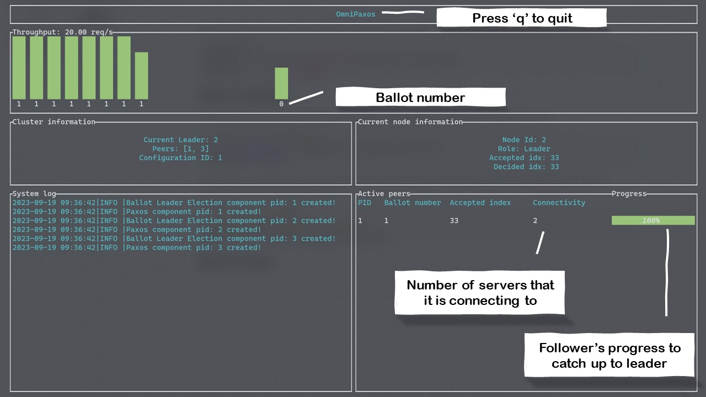

OmniPaxos supplies an in-terminal dashboard that works out-of-the-box by importing the `omnipaxos_ui` dependency:

```rust
[dependencies]
omnipaxos = { version = "LATEST_VERSION", features = ["macros"] }
omnipaxos_ui = "LATEST_VERSION"
```

## How To Setup

We need to setup and start the dashboard using the same configuration that used to setup OmniPaxos:

```rust
// op_config: OmniPaxosConfig
let mut omni_paxos_ui = OmniPaxosUI::with(op_config.into());
omni_paxos_ui.start();
```

To flush the UI,  a `tick()` function need to be called periodically with the stated retrieved from OmniPaxos instance. For example, if `tick()` is called every 200ms:

```rust
// Call this periodically
// omni_paxos: OmniPaxos<Entry, Storage>
omni_paxos_ui.tick(omni_paxos.get_ui_states());
```

## How To Use

The dashboard has two different views for leader server and follower servers. The information of leader's dashboard is as shown bellow:

