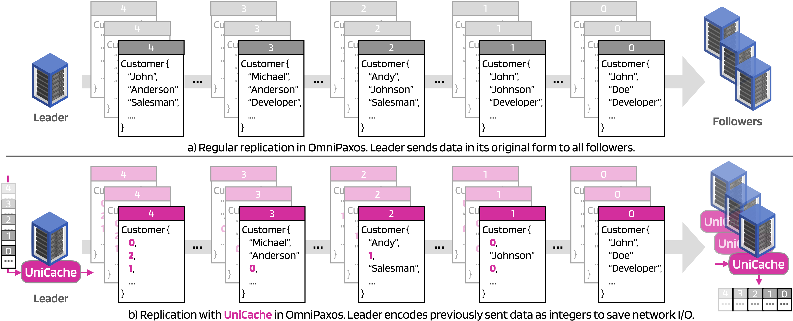

UniCache is a feature that introduces a cache in OmniPaxos to handle skewed data. **UniCache acts as a dictionary that maps popular data to smaller encodings**. Users annotate fields in the `Entry` that are cachable, and when such a value is encountered, it gets transmitted as an encoding instead. In this way, OmniPaxos can reduce the network I/O in skewed workloads by encoding frequently repeated data.



## Example
As an example, consider an online store that stores its customers in a distributed database replicated by OmniPaxos. 
```rust
use omnipaxos::macros::Entry;

#[derive(Clone, Debug, Eq, Entry)]
struct Customer {
    id: u64,
    first_name: String,
    last_name: String,
    email: String,
    profession: String,
}
```
Each customer has unique `id` and `email`, but the `first_name`, `last_name`, and `profession` are fields that may repeat for different customers. For instance, there might be many customers with the first name `"John"` and the profession `"Developer"`. If the OmniPaxos servers have replicated these values before, it would be unnecessary to resend these values whenever we encounter them again in the future.

##  Using UniCache
To avoid the redundant replication, we can use the `unicache` feature and define `Customer` as follows:
```toml
[dependencies]
omnipaxos = { version = "LATEST_VERSION", features = ["unicache"] }
```

```rust
use omnipaxos::macros::UniCacheEntry;

#[derive(Clone, Debug, Eq, UniCacheEntry)]
struct Customer {
    id: u64,
    #[unicache(encoding(u8))]
    first_name: String,
    #[unicache(encoding(u16), size(1000))]
    last_name: String,
    email: String,
    #[unicache(encoding(u16), cache(lru))]
    profession: String,
}
``` 
Instead of deriving `Entry` for the struct `Customer`, we are now deriving `UniCacheEntry`. The `first_name` is annotated with
`#[unicache(encoding(u8)]` which implies that if there is a cache hit, the value will be sent as a `u8` instead of the original type (`String`). Other attributes are the `size` and `cache`. The `size` lets users define the cache size for the field. The `cache` lets us set the eviction policy to `lfu` (least-frequently-used) or `lru` (least-recently-used).

> **Note:** Users only need to specify which fields are cachable (e.g., `first_name` and `profession`) and not the values of them. UniCache will cache the values of those fields according to the eviction policy.

## What's going on under the hood?
To understand how UniCache works, consider an example where we replicate two customers in OmniPaxos:
```rust
let omnipaxos: OmniPaxos = ... // initialise OmniPaxos
let customer0 = Customer {
    id: 0,
    first_name: "John",
    last_name: "Doe",
    email: "jd@omnipaxos.com",
    profession: "Developer",
};
let customer1 = Customer {
    id: 1,
    first_name: "John",
    last_name: "Johnson",
    email: "jj@kth.se",
    profession: "Developer",
};
omnipaxos.append(customer0);
omnipaxos.append(customer1);
```
The first time we perform append with `customer0`, it gets replicated as usual, but the values of the UniCache fields (i.e., `"John"`, `"Doe"`, `"Developer"`) get cached.

When we replicate the second customer, UniCache will replace any cached values with their index in the cache. In OmniPaxos, `customer1` would be sent over the network as the following instead:
```rust
/* Encoded version of second_customer in OmniPaxos */
let enc_customer1 = EncodedCustomer {
    id: 1,
    first_name = 0,       // "John" is replaced by an integer (u16)
    last_name = "Johnson", // "Johnson" was a cache miss. So it is sent in its original form.
    email = "jj@kth.se",
    profession = 0,        // "Developer" is replaced by an integer (u8)
}
```
As `"John"` and `"Developer"` were in the cache, they get sent over the network as encoded integers (`u8` and `u16`) instead of their original `String` values. The benefit here is that we send less data over the network by remembering the values we have sent before. So instead of sending `"John"` as 4 bytes and `"Developer"` as 9 bytes, we send them as `u8` and `u16` instead that are one byte and 2 bytes respectively. In this way, we compress these two fields by `1 - (3/13) = 77%`.

UniCache guarantees that the encoded values get decoded back to the original values (e.g., `"John"` and `"Developer"`) before getting stored at the receiving servers. Notice that the `enc_customer1` is not visible or stored, it is simply the network representation in OmniPaxos. If we read the log, `customer1` will still be in its original form.
```rust
let read_second_customer = omnipaxos.read_decided_suffix(1);
match read_second_customer {
    LogEntry::Decided(read) => {
        assert_eq!(read, customer1);
    },
    _ => {},
}
```
> **Note:** The cached values only get encoded in the messages being sent in OmniPaxos. UniCache can therefore only reduce the size of the messages but not the storage.
 
For more details on the design and benefits of UniCache, check out our [paper](https://openproceedings.org/2023/conf/edbt/3-paper-117.pdf) from EDBT2023.